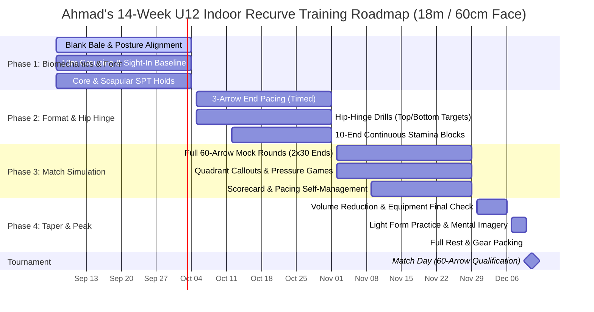

```mermaid
gantt
    title Ahmad's 14-Week U12 Indoor Recurve Training Roadmap (18m / 60cm Face)
    dateFormat  YYYY-MM-DD
    axisFormat  %b %d

    section Phase 1: Biomechanics & Form
    Blank Bale & Posture Alignment         :active, p1_1, 2026-09-07, 2026-10-04
    18m Grouping & Sight-In Baseline       :p1_2, 2026-09-07, 2026-10-04
    Core & Scapular SPT Holds              :p1_3, 2026-09-07, 2026-10-04

    section Phase 2: Format & Hip Hinge
    3-Arrow End Pacing (Timed)             :p2_1, 2026-10-05, 2026-11-01
    Hip-Hinge Drills (Top/Bottom Targets)  :p2_2, 2026-10-05, 2026-11-01
    10-End Continuous Stamina Blocks       :p2_3, 2026-10-12, 2026-11-01

    section Phase 3: Match Simulation
    Full 60-Arrow Mock Rounds (2x30 Ends)  :p3_1, 2026-11-02, 2026-11-29
    Quadrant Callouts & Pressure Games     :p3_2, 2026-11-02, 2026-11-29
    Scorecard & Pacing Self-Management     :p3_3, 2026-11-09, 2026-11-29

    section Phase 4: Taper & Peak
    Volume Reduction & Equipment Final Check:p4_1, 2026-11-30, 2026-12-06
    Light Form Practice & Mental Imagery   :p4_2, 2026-12-07, 2026-12-10
    Full Rest & Gear Packing               :crit, p4_3, 2026-12-10, 2026-12-10

    section Tournament
    Match Day (60-Arrow Qualification)     :milestone, m1, 2026-12-11, 0d
```
